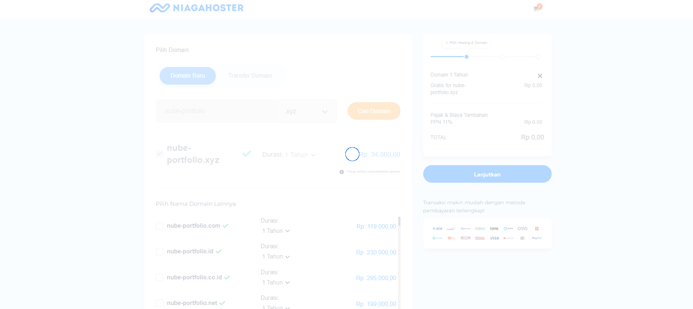
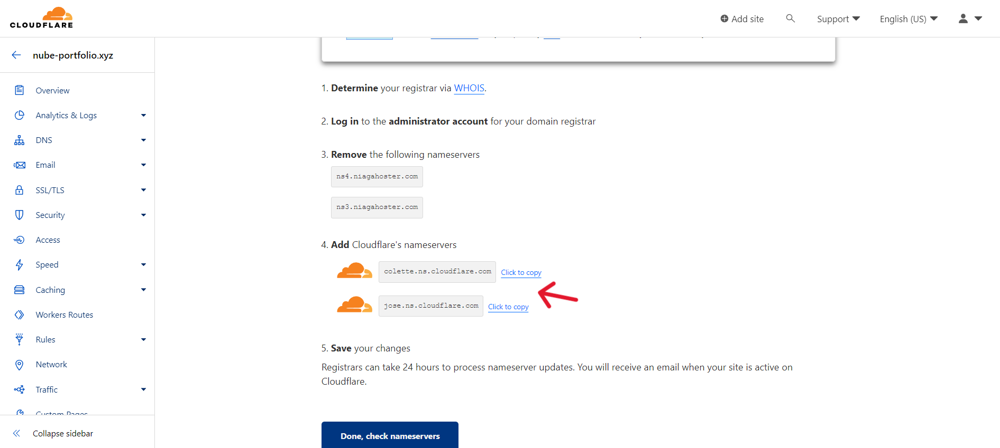
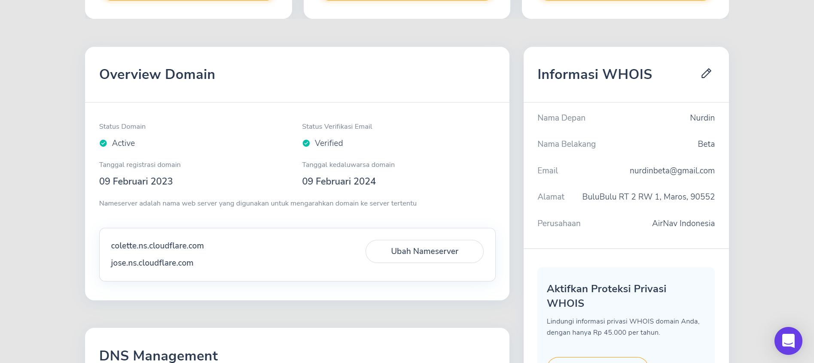

# My Portfolio

> This is an example assignment of process of deployment in Netlify, buy own domain in Niagahoster, SetUp DNS and Web hosting in CloudFlare.

## Link Preview

1. Netlify : https://nube-portfolio.netlify.app/
2. Own Domain : https://nube-portfolio.xyz/

## Deployment on Netlify

1. Open Netlify on your browser, then click sign up or click log in if you already have the account.

2. On the sign up and log in page, there are four option to sign up and log in, for example i choose GitHub log in option.

3. After log in, you will ask for permission to authorize your GitHub account to Netlify, then click Authorize netlify.

4. After log in, you'll be on your account page, then scroll down to Sites section, click add new sites, then choose import an existing project.

5. Then you'll rediricting to step 1 connect to git provider, and click GitHub.

6. On the step 2 you have to pick a repository from your GitHub, because the repository that i've made is in revou-fsse-1, then i choose revou-fsse-1, then it'll be aouthorized to looking for your project.

7. After that search your project by typing the name of your project for easy to find if there are a lot of project on the repository, then choose the project you want to deploy.

8. On the step 3, you'll setting the project by choose the owner, branch and other advance setting, after all good, then click deploy site.

9. Your project now on process to deploy.

10. After your project completed deployed, your domain will be random choose by netlify, to change your domain name, click domain setting.

11. Then choose option and edit site name.

12. Change the random domain name to the new domain name that you want, then click save.

13. Now your new domain name is already set up, you can check if it's work by clicking the domain, then the deployment process is finished.

## Buy Domain in Niagahoster, Setup DNS and Hosting on Cloudflare

1. Open Niagahoster on your browser, the click login.

2. If you haven't the account yet, then click sign up, or you can login by using facebook or google account, for example i'm login by using google account.

3. After completed the login process, then click order new service.

4. Choose domain and click order now.

5. After that type and choose your new custom domain, then click find domain.

6. There gonna be a lot of option, click the option that you want, then click add to cart.

7. Choose without hosting package, then click continue.

8. After that choose the payment method, and then click checkout now.

9. Fill the information required then click save.

10. Pay the bill, wait until it's success.

11. After success, click services, click domain and click manage services, then you'll be directing to your domain page.

12. For web hosting, open CloudFlare on your browser, click sign up or log in if you already have the account.

13. Fill email and password, the click create account.

14. After completed, then you'll be on your account page, then click add site.

15. Fill the domain that you already bought on Niagahoster, then click add site.

16. After that you have to select your plan, for example i choose a free plan, then you're gonna review the DNS record by adding the record.

17. Choose the type form with CNAME, fill the name form with your own domain that you've bought and fill the content form with the domain of your website that you wanna connected with your own domain, then click continue.

18. After that add CloudFlare nameservers to your own domain nameservers in Niagahoster by click change nameservers, then fill it with then name servers in CloudFlare.

19. Then go to Netlify, and open your deployed website, and set up a custom domain with your own domain and click verify.

20. Then back to CLoudFlare, follow the quick start guide for configure your domain setting, then click finish. After that wait until the hosting completed. There are gonna be notification on your email if its completed or you can check in your home page.

21. After the domain is activated in CloudFlare then back to your Netlify to check if your own domain already hosted. then the process is finished.

